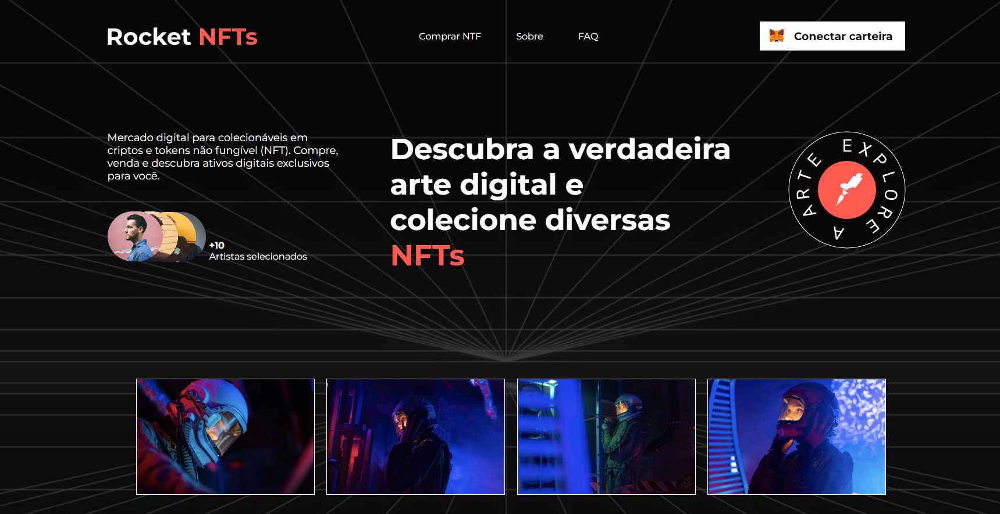

<h1 align="center">
    
</h1>

<h4 align="center"> 
	🚧 Rocket NFT 🚀 em construção... 🚧
</h4>
 

  
    

## 💻 Sobre o projeto

Este projeto foi desenvolvido apartir de um desafio proposto pela Rocketseat, com o intuito de treinar e fixar as abilidades ensinadas nas aulas dos Niveis 01, 02 e 03.

Uma experiência online com muito conteúdo prático, desafios e hacks onde o conteúdo fica disponível para os alunos durante um ano.

## 🎨 Layout

O layout da aplicação está disponível no Figma:

### Mobile

🚧 em construção... 🚧

### Web

  

 

## 🛠 Tecnologias

As seguintes ferramentas foram usadas na construção do projeto:

- [HTML]
- [CSS]
- [javascript]
- [GIT]
- [GitHub]

## 📝 Licença

Este projeto esta sobe a licença MIT.

Feito com ❤️ por Francisco Rosndo 👋🏽 [Entre em contato!](https://www.linkedin.com/in/francisco-rosendo-a05623241/)
